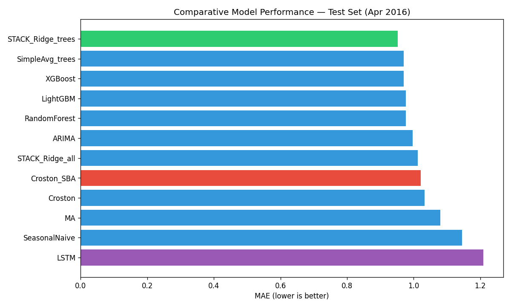
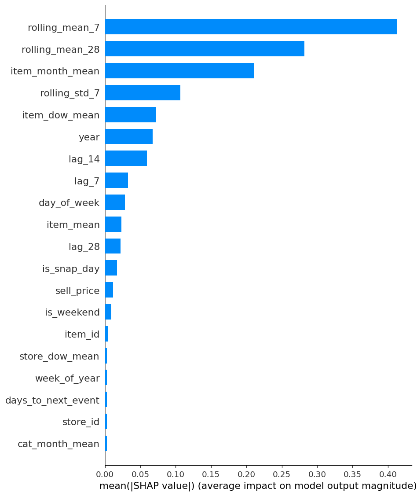
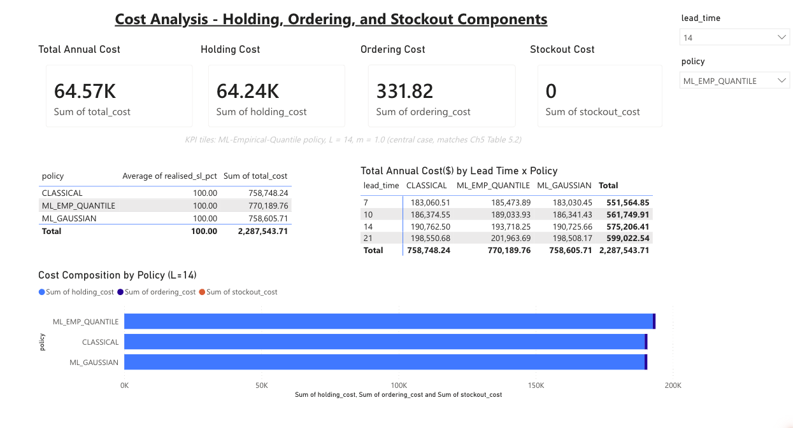

# Demand Forecasting and Inventory Optimisation Using Machine Learning

**Does machine-learning demand forecasting actually lower retail inventory cost — or does that only look true because nobody measures it?**

A simulation-based evaluation on the M5-Forecasting (Walmart) dataset, delivered
with a free, open-source diagnostic tool that lets any retailer test the question
against their own data before spending anything.


> Master's thesis in Data Science · Desmond Korbla Aziega, Theresa Korlekuor
> Apla-Kweku, Abdul-Razak Seidu · Supervisor: Prof. Rocío González Martínez · 2026

---

## The headline finding

Published studies routinely report **10–25% forecast accuracy gains** and
**5–15% inventory cost reductions** from machine learning (Barghi, 2025; Seyedan
et al., 2023). This project set out to test whether those numbers survive at
**SKU-daily granularity** — the level at which a real reorder decision is
actually made — with inventory outcomes **measured by forward simulation rather
than assumed by formula**.

They do not. And the reason is the interesting part.

| | Earlier analytical draft | This study (simulated) |
|---|---|---|
| Method | Service level **assigned** from a formula | Service level **measured** day-by-day |
| Reported saving | **21% cost reduction** | **1.5% cost *increase*** |
| Why | Quantile policy was handed a 95% service level "by calibration" vs. the Gaussian policy's 83% — it won before any demand was simulated | All three policies achieve **100% realised service**; there are no stockouts for a better buffer to prevent |

When the `(R, s, S)` policy is run forward against real demand for all 502
series, **no policy ever stocks out**. With zero stockout cost on the table,
the more accurate forecast has nothing to save, and the distribution-aware
safety-stock buffer becomes pure additional holding cost.

**The contribution is therefore not a percentage — it is a boundary condition:**
ML forecasting and distributional safety stock affect inventory outcomes *when,
and only when, the baseline policy is genuinely exposed to stockout risk.*
Everything else in this repository exists to establish that claim rigorously and
to hand practitioners a way to test which side of it they are on.

---

## Contents

- [What was built](#what-was-built)
- [Results — forecasting](#results--forecasting)
- [Results — inventory](#results--inventory)
- [Why you can trust the simulation](#why-you-can-trust-the-simulation)
- [The open-source tool](#the-open-source-tool)
- [The dashboard](#the-dashboard)
- [Repository structure](#repository-structure)
- [Reproducing this work](#reproducing-this-work)
- [Future research directions](#future-research-directions)
- [Documents](#documents)

---

## What was built

An end-to-end pipeline from raw point-of-sale records to an inventory decision,
built entirely on free and open-source tooling and runnable on a standard
16 GB laptop with **no GPU** in **under three hours**.

```
Raw M5 data  →  Feature engineering  →  5 model tiers  →  (R,s,S) inventory
(3,049 series)   (25 features +          (12 models)       policy simulation
                  8 target encodings)                            ↓
                                                          Power BI dashboard
```

**Five model tiers**, structured as a ladder so each has to earn its place:

| Tier | Approach | Models |
|:--|:--|:--|
| 1 | Classical statistical | Moving Average, SES, AutoARIMA, **Croston**, **Croston-SBA**, Seasonal Naive |
| 2 | Standard ML | Random Forest, **XGBoost**, **LightGBM** (Tweedie loss for zero-inflated counts) |
| 3 | Deep learning | LSTM — 128/64 stacked units, dropout 0.2, 28-day lookback |
| 4 | Ensemble | **Stacking**: LightGBM + XGBoost + RF → non-negative Ridge meta-learner |
| 5 | Probabilistic | LightGBM **quantile regression** (P10, P50, P90, P95, P99) |

Croston and Croston-SBA are included because SKU-daily retail demand is
*intermittent* — many zero-sale days punctuated by spikes — a regime where
conventional methods are known to underperform (Croston, 1972; Syntetos &
Boylan, 2005).

Training respects strict chronological order. All twelve models are evaluated on
the same unseen 56-day window (March–April 2016); target encodings are computed
on the training window only, so no future information leaks backwards.

---

## Results — forecasting

The stacking ensemble is the most accurate of the twelve models tested.



| Model | MAE | RMSE | MAPE % | WMAPE % |
|:--|--:|--:|--:|--:|
| **STACK_Ridge_trees** (ensemble) | **0.952** | 1.860 | 57.82 | **73.58** |
| SimpleAvg_trees | 0.970 | 1.900 | 53.85 | 74.95 |
| XGBoost | 0.970 | 1.932 | 53.15 | 74.97 |
| LightGBM | 0.976 | 1.953 | 53.66 | 75.44 |
| RandomForest | 0.977 | 1.879 | 55.60 | 75.49 |
| AutoARIMA *(best classical on MAE)* | 0.997 | 2.055 | 58.45 | 77.04 |
| Croston-SBA *(best classical on MAPE)* | 1.021 | 2.089 | 57.63 | 78.87 |
| LSTM | 1.209 | 2.364 | 58.49 | 93.40 |

**Improvement over the strongest classical baseline: 4.5% MAE, 9.5% RMSE — and
approximately flat on MAPE (−0.3%).**

That falls well short of the 10–25% literature benchmark, and the shortfall is
itself a finding rather than a modelling failure. Those benchmarks are measured
on data aggregated to the weekly or category level, where averaging smooths away
the intermittency. At SKU-daily granularity the residual variance is bounded
below by genuine, irreducible demand noise. MAPE in particular becomes unstable
when a large share of actuals are zero, which is why WMAPE is reported alongside it.

The LSTM finishing last replicates Nasseri et al. (2023): tree-based learners
with rich engineered features capture the cross-sectional structure of
intermittent demand more efficiently than a sequence model can learn it from
sequences alone.

### What actually drives the forecast



The top five features account for **78.6%** of model behaviour — recent rolling
means and item-level seasonality, not opaque signals. In practical terms, the
model systematises what an experienced store manager already tracks intuitively.

| Rank | Feature | Share of total SHAP |
|:--|:--|--:|
| 1 | `rolling_mean_7` | 29.9% |
| 2 | `rolling_mean_28` | 20.4% |
| 3 | `item_month_mean` | 15.3% |
| 4 | `rolling_std_7` | 7.7% |
| 5 | `item_dow_mean` | 5.3% |

A fairness check disaggregating error by product category and by US state
confirmed no segment performs more than 2× worse than another; the variation
that does exist tracks demand volume and intermittency, not disparate treatment.

---

## Results — inventory

Forecasts are integrated with a periodic **`(R, s, S)` Order-Up-To-Level policy**
(Silver, Pyke & Thomas, 2017): review every `R = 7` days, and if the inventory
position has fallen to or below reorder point `s`, order back up to level `S`.

Three policies are compared. They are **identical except for how safety stock is
computed**, which isolates exactly the effect under test:

| Policy | Safety stock formula |
|:--|:--|
| Classical | `SS = z · σ · √(R+L)` — Gaussian, from classical-forecast residuals |
| ML-Gaussian | `SS = z · σ · √(R+L)` — Gaussian, from ML-ensemble residuals |
| ML-Empirical-Quantile | `SS = (P95 − P50) · √(R+L)` — read from the actual demand distribution |

The Gaussian formula assumes forecast errors are symmetric and bell-shaped.
Intermittent retail demand is neither — it is right-skewed with a heavy upper
tail. The empirical quantile buffer measures **1.36×** the Gaussian-implied one.

### Central case (L = 14 days, m = 1.0)

| Policy | Realised SL | Safety stock | Holding $ | Ordering $ | Stockout $ | **Total $** | vs. Classical |
|:--|--:|--:|--:|--:|--:|--:|--:|
| Classical | **100.0%** | 4,620 | 63,256 | 332 | **0** | **63,588** | — |
| ML-Gaussian | **100.0%** | 4,572 | 63,243 | 332 | **0** | **63,575** | −$12 (0.0%) |
| ML-Empirical-Quantile | **100.0%** | 6,287 | 64,241 | 332 | **0** | **64,573** | **+1.5%** |

Holding cost is ~99.5% of total cost and is nearly identical across policies.
Stockout cost is exactly zero for all three. There is structurally no room for a
safety-stock formula to differentiate cost when the thing it insures against
never happens.

**The reinterpretation matters more than the number.** The 1.36× spread is a
fixed, measured property of the data — it does not change between the earlier
draft and this one. What changes is what it means. The analytical draft read it
as evidence the Gaussian buffer was leaving demand uncovered. Simulation shows
the smaller Gaussian buffer already meets demand in full, so the same 1.36×
represents **36% surplus inventory**, not a coverage gap.

### Robustness

| Swept parameter | Range | Effect on the comparison |
|:--|:--|:--|
| Lead time `L` | 7 → 21 days | Quantile policy stays 1.3–1.7% more expensive; never favourable |
| Stockout multiplier `m` | 0.4× → 2.0× | **No change at all** — the multiplier scales a stockout cost that is zero |

The stockout-multiplier result is the strongest robustness evidence available
here: in a regime with genuine stockouts, `m` would be the single most
influential parameter in the analysis. Its complete irrelevance *is* the
saturated-service finding, stated a second way.

---

## Why you can trust the simulation

A simulation that reports zero stockouts is worthless unless you can show it
would have caught one. So it was deliberately broken, four ways:

| Stress condition | Realised SL | Stockout cost | Unmet units |
|:--|--:|--:|--:|
| Real buffers (baseline) | 100.0% | $0 | 0 |
| Safety stock forced to zero | **74.0%** | $124,338 | 9,306 |
| Realised demand scaled ×3 | **94.1%** | $87,691 | 6,328 |
| Replenishment suppressed entirely | **0.0%** | $469,556 | 35,734 |

Every condition correctly degraded service and escalated cost. The 100% baseline
therefore reflects demand genuinely being met — not a counter that never fires.

Notably, even a **threefold demand shock** is not enough on this dataset to make
the quantile policy clearly superior (it ties the classical baseline at +0.0%).
The boundary at which the more sophisticated buffer starts paying for itself
lies beyond ×3 demand here, which is itself a reportable result.

Reproduce with: `python src/falsification_tests.py`

---

## The open-source tool

**[`src/inventory_simulation.py`](src/inventory_simulation.py)** is the practical
deliverable — a dependency-light forward `(R, s, S)` simulator that answers the
one question determining whether any of this investment pays off:

> *Under our current, simpler policy, how often do we actually run out of stock —
> and what does it cost us?*

If the answer is "rarely, and not much", the evidence here says a more
sophisticated forecasting and safety-stock stack is unlikely to recover its cost,
and the budget is better spent elsewhere. If the answer is "often, and
expensively", you are in the regime where the literature's benchmarks were
obtained and where the investment is likely to pay off.

### Try it immediately — no data setup required

```bash
git clone https://github.com/Daziega/retail-demand-forecasting.git
cd retail-demand-forecasting
pip install numpy pandas          # the engine needs nothing else

python src/inventory_simulation.py --demo
```

`--demo` generates 502 synthetic intermittent series that mimic M5's
zero-inflated, right-skewed shape, then prints the full comparison: realised
service level, safety stock, cost decomposition, and sensitivity to both lead
time and stockout multiplier. Demo output is written to
`data/processed/simulation_results_demo.csv` and never touches the committed
real-data results.

### Run it on the real M5 pipeline outputs

```bash
python src/inventory_simulation.py
```

This reads the trained-pipeline artefacts and writes the full
lead-time × multiplier grid to `data/processed/simulation_results.csv`.
It requires `artifacts/*.parquet`, which are regenerated by running notebooks
04–09 (they are too large to commit).

### Point it at *your own* data

Replace `load_real_dataset()` with your own loader. Each product-store series
needs seven fields, all of which a standard POS export plus any forecast can
supply:

| Field | Meaning |
|:--|:--|
| `test_demand` | Actual daily units over the evaluation window |
| `level_forecast` | Mean daily demand forecast `d̄` |
| `sigma_classical` | Std. dev. of your current method's residuals |
| `sigma_ml` | Std. dev. of the ML forecast's residuals |
| `q50`, `q95` | Median and 95th-percentile daily demand |
| `price` | Unit selling price |

Economic constants (carrying rate 25%, order cost $50, gross margin 40%, review
period 7 days, 95% target service level) are module-level constants at the top of
the file — change them to match your operation.

**Requirements to deploy this in a real SME:** three data fields any standard POS
or ERP already produces; free and open-source libraries only; a standard laptop;
and one analyst with roughly 12–18 months of Python experience. No data-science
team, no GPU, no licence fees.

---

## The dashboard

A four-page Power BI report (free tier) turns the pipeline's CSV feeds into
something a non-technical manager can interrogate — changing service-level
target, lead time, or stockout multiplier and watching the comparison respond.



| Page | Purpose |
|:--|:--|
| Forecast Overview | Actual vs. ML-ensemble vs. classical, with per-SKU drilldown |
| Inventory Status | Safety stock, reorder point, order-up-to level per series |
| Cost Analysis | Holding / ordering / stockout decomposition across policies |
| Sensitivity Analysis | Cost response to lead time and stockout-cost assumptions |

Source file: [`dashboard/Retail_Demand_Dashboard_Report.pbix`](dashboard/) ·
data feeds: `data/processed/powerbi/` (five CSVs, designed for daily refresh).

---

## Repository structure

```
retail-demand-forecasting/
├── src/
│   ├── inventory_simulation.py   ★ the open-source diagnostic tool
│   ├── falsification_tests.py      stress tests proving the engine detects stockouts
│   └── forecasting_utils.py        chronological splits, metrics, walk-forward CV
│
├── notebooks/                      01 → 12, the full pipeline in execution order
│   ├── 01_eda · 02_preprocessing · 03_feature_engineering
│   ├── 04_baseline_models · 05_ml_models · 07_lstm-model
│   ├── 06_model_evaluation · 08_stacking_ensemble · 09_quantile_forecast
│   └── 10_outl_inventory · 11_sensitivity_analysis · 12_dashboard_exports
│
├── data/
│   ├── raw/                        Kaggle M5 input — not redistributed (see its README)
│   └── processed/                  results, leaderboards, SHAP, simulation grid, PBI feeds
│
├── dashboard/                      Power BI .pbix + page screenshots
├── figures/                        analysis figures used in the thesis
├── docs/
│   ├── thesis/                     full thesis, executive summary, abstract (EN/ES)
│   └── defence/                    defence slide deck
└── archive/thesis-build/           document-generation scripts and superseded drafts
```

---

## Reproducing this work

```bash
# 1. Environment (Python 3.11, versions pinned to those used for the results)
python3.11 -m venv .venv && source .venv/bin/activate
pip install -r requirements.txt

# 2. Data — follow data/raw/README.md to fetch the three M5 files from Kaggle

# 3. Pipeline — run notebooks in numerical order (~3 hours total, CPU only)
jupyter lab notebooks/

# 4. Inventory simulation and engine validation
python src/inventory_simulation.py
python src/falsification_tests.py
```

The 502-series stratified subsample is drawn with a fixed seed (42) and its exact
IDs are committed to `data/processed/subsample_series_ids.csv`, so the sample is
reproducible without re-running the sampling step.

**You do not need the raw data to inspect the findings** — every result table,
leaderboard, SHAP ranking, and the complete simulation grid is committed under
`data/processed/`.

---

## Future research directions

The clearest extensions, in rough order of value:

1. **Test the boundary condition where it should bind.** Validate in a live SME
   deployment whose baseline policy is *known* to face stockout risk. This is the
   regime the evidence predicts a real benefit, and the one this test window
   could not exercise.
2. **Longer and multiple test windows.** A single 56-day window cannot exercise
   the stockout regime. Rolling-origin evaluation across several seasons —
   including a demand spike — would establish how window-dependent the result is.
3. **More volatile benchmarks.** Re-run on Rossmann or Favorita, where demand is
   less well-buffered, to locate where the cost ranking flips.
4. **Non-linear stockout costs.** Real penalties compound — repeated stockouts
   drive customer churn. A convex cost function would raise the value of the
   distribution-aware buffer and shift the boundary.
5. **Formal uncertainty quantification.** Bootstrapped confidence intervals on
   the 4.5% MAE gain across series, which this study reports as a point estimate.
6. **Full-scale replication.** All 3,049 M5 series rather than the 502-series
   stratified subsample.
7. **Lead-time uncertainty.** Lead time is treated as deterministic here; making
   it stochastic is the most realistic next modelling step for the engine.

---

## Documents

| Document | Description |
|:--|:--|
| [Full thesis](docs/thesis/Thesis_Full.pdf) | Complete manuscript, ~150 pages |
| [Executive summary](docs/thesis/Executive_Summary.pdf) | Management-oriented, non-technical |
| [Abstract (EN/ES)](docs/thesis/Abstract_EN_ES.pdf) | Bilingual abstract |
| [Defence slides](docs/defence/Thesis_Defence.pdf) | 26-slide defence deck |

---

## Key references

- Barghi, S. (2025). *Demand forecasting and inventory improvement in supply chain management using hybrid boosting ensemble techniques.* Master's thesis, ÉTS, Université du Québec.
- Croston, J. D. (1972). Forecasting and stock control for intermittent demands. *Operational Research Quarterly, 23*(3), 289–303.
- Nasseri, M., Falatouri, T., Brandtner, P., & Darbanian, F. (2023). Applying machine learning in retail demand prediction — A comparison of tree-based ensembles and LSTM-based deep learning. *Applied Sciences, 13*(19), 11112.
- Seyedan, M., Mafakheri, F., & Wang, C. (2023). Order-up-to-level inventory optimization model using time-series demand forecasting with ensemble deep learning. *Supply Chain Analytics, 3*, 100024.
- Silver, E. A., Pyke, D. F., & Thomas, D. J. (2017). *Inventory and production management in supply chains* (4th ed.). CRC Press.
- Syntetos, A. A., & Boylan, J. E. (2005). The accuracy of intermittent demand estimates. *International Journal of Forecasting, 21*(2), 303–314.

Full reference list (52 sources) in the thesis.

---

## Citation

```bibtex
@mastersthesis{aziega2026demand,
  title  = {Demand Forecasting and Inventory Optimisation Using Machine Learning},
  author = {Aziega, Desmond Korbla and Apla-Kweku, Theresa Korlekuor and Seidu, Abdul-Razak},
  year   = {2026},
  note   = {Supervisor: Prof. Roc\'{i}o Gonz\'{a}lez Mart\'{i}nez}
}
```

## Licence

Source code released under the [MIT Licence](LICENSE). The M5 dataset is obtained
separately from Kaggle under its own terms and is not redistributed here. Thesis
documents are shared for reference — please cite rather than reuse.
